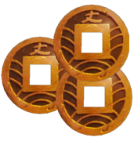

<!--
*** Thanks for checking out this README Template. If you have a suggestion that would
*** make this better, please fork the repo and create a pull request or simply open
*** an issue with the tag "enhancement".
*** Thanks again! Now go create something AMAZING! :D
***
***
***
*** To avoid retyping too much info. Do a search and replace for the following:
*** github_username, repo_name, twitter_handle, email
-->


<!-- PROJECT SHIELDS -->
<!--
*** I'm using markdown "reference style" links for readability.
*** Reference links are enclosed in brackets [ ] instead of parentheses ( ).
*** See the bottom of this document for the declaration of the reference variables
*** for contributors-url, forks-url, etc. This is an optional, concise syntax you may use.
*** https://www.markdownguide.org/basic-syntax/#reference-style-links
-->
[![Contributors][contributors-shield]][contributors-url]
[![Forks][forks-shield]][forks-url]
[![Stargazers][stars-shield]][stars-url]
[![Issues][issues-shield]][issues-url]
[![MIT License][license-shield]][license-url]


<!-- PROJECT LOGO -->
<br />
<p align="center">
  <a href="https://github.com/amateurdullahan/TokaidoNakama">
    
  </a>

  <h3 align="center">Tokaido Nakama</h3>

  <p align="center">
    Gameplay aid for the board game Tokaido
    <br />
    <a href="https://github.com/amateurdullahan/TokaidoNakama"><strong>explore the docs »</strong></a>
    <br />
    <br />
    <a href="https://youtu.be/1YjxbwHUZUw">view demo</a>
    ·
    <a href="https://github.com/amateurdullahan/TokaidoNakama/issues">report bug</a>
    ·
    <a href="https://github.com/amateurdullahan/TokaidoNakama/issues">request feature</a>
  </p>
</p>


<!-- TABLE OF CONTENTS -->
## Table of Contents

* [About the Project](#about-the-project)
  * [Built With](#built-with)
* [Getting Started](#getting-started)
  * [Installation](#installation)
* [Usage](#usage)
* [Roadmap](#roadmap)
* [Contributing](#contributing)
* [License](#license)
* [Contact](#contact)
* [Acknowledgements](#acknowledgements)


<!-- ABOUT THE PROJECT -->
## About The Project

[![Product Name Screen Shot][product-screenshot]](https://amateurdullahan.github.io/TokaidoNakama/)

**Tokaido Nakama** assists users with tracking their player score, coin count, and all probabilities while playing the board game Tokaido.  This project was designed by [Robert Rowe](https://github.com/robertrowe1013), with back-end programming by [Dylan Carey](https://github.com/amateurdullahan), and the front-end programming by [Corbin Enterline](https://github.com/corbinenterline1). This application was created as a final project for the Foundations year at Holberton School.  The inspiration was something in the board game space that had not been done before, that would also showcase our skills and help shape our interests in game design.


### Built With

* [Python](https://www.python.org/)
* [Pygame](https://www.pygame.org/news)
* [Pygame-menu](https://github.com/ppizarror/pygame-menu)


<!-- GETTING STARTED -->
## Getting Started

To get a local copy up and running follow these simple steps.


### Installation

1.
Option A - Clone the repo
```sh
git clone https://github.com/amateurdullahan/TokaidoNakama.git
```
**or**

Option B - Download and extract the ZIP


2. Run **screen.pyw**


<!-- USAGE EXAMPLES -->
## Usage

To begin, click on **screen.py** to launch the application.

You will be greeted with the player selection. Currently the app only supports 3 players (2 & 4-5 are coming). You select the players in order of starting turns.

From there the application will indicate at the top of the screen which player's turn it is. Click on the appropriate board space to select any action(s) pertaining to that space, if any. The app will automatically move the player piece, and update all scores/coins/probabilities as needed. Automagic!


<!-- ROADMAP -->
## Roadmap

* Player Count (2, 4-5): Neutral traveller needs to be implemented for 2 player games, the expanded spaces need to be coded for 4 and 5 players.
* Achievement Tracking: Most of the functionality has been coded and commented out. Temple bonus doesn't track properly, also want to include an option to either have the acheivements updated each turn and included in the current score or to not include the acheivement points until the final score. 
* Expansions: Additional traveler and encounter card promos, the mitsuri cards for the inn spaces, and the Crossroads alternate actions for each space.
* Rule Variations: Add in traveler tile abilities, Return Trip and Gastronomy variants, and alternate starting money for Preperations.


<!-- CONTRIBUTING -->
## Contributing

Contributions are what make the open source community such an amazing place to be learn, inspire, and create. Any contributions you make are **greatly appreciated**.

1. Fork the Project
2. Create your Feature Branch (`git checkout -b feature/AmazingFeature`)
3. Commit your Changes (`git commit -m 'Add some AmazingFeature'`)
4. Push to the Branch (`git push origin feature/AmazingFeature`)
5. Open a Pull Request


<!-- LICENSE -->
## License

Distributed under the MIT License. See `LICENSE` for more information.


<!-- CONTACT -->
## Contact

Designer: Robert Rowe - [@RobertRowe1013](https://twitter.com/robertrowe1013) - [LinkedIn](https://www.linkedin.com/in/robert-rowe-8a41b71a1/)

Back-End Programmer: Dylan Carey - [@twitter_handle](https://twitter.com/twitter_handle) - [LinkedIn](https://www.linkedin.com/in/dylan-carey-7981b71a1/)

Front-End Programmer: Corbin Enterline - [@nibroc_corbin](https://twitter.com/nibroc_corbin) - [LinkedIn](https://www.linkedin.com/in/corbin-enterline-87451247/)

Project Link: [Tokaido Nakama Landing Page](https://amateurdullahan.github.io/TokaidoNakama/)


<!-- ACKNOWLEDGEMENTS -->
## Acknowledgements

* [Brett Davis - Menu Assistance](https://github.com/MenacingManatee)
* [Best-README-Template](https://github.com/othneildrew/Best-README-Template)


<!-- MARKDOWN LINKS & IMAGES -->
<!-- https://www.markdownguide.org/basic-syntax/#reference-style-links -->
[contributors-shield]: https://img.shields.io/github/contributors/amateurdullahan/TokaidoNakama.svg?style=flat-square
[contributors-url]: https://github.com/amateurdullahan/TokaidoNakama/graphs/contributors
[forks-shield]: https://img.shields.io/github/forks/amateurdullahan/TokaidoNakama.svg?style=flat-square
[forks-url]: https://github.com/amateurdullahan/TokaidoNakama/network/members
[stars-shield]: https://img.shields.io/github/stars/amateurdullahan/TokaidoNakama.svg?style=flat-square
[stars-url]: https://github.com/amateurdullahan/TokaidoNakama/stargazers
[issues-shield]: https://img.shields.io/github/issues/amateurdullahan/TokaidoNakama.svg?style=flat-square
[issues-url]: https://github.com/amateurdullahan/TokaidoNakama/issues
[license-shield]: https://img.shields.io/github/license/amateurdullahan/TokaidoNakama.svg?style=flat-square
[license-url]: https://github.com/amateurdullahan/TokaidoNakama/blob/main/LICENSE.txt
[product-screenshot]: media/fullscreen.jpg
